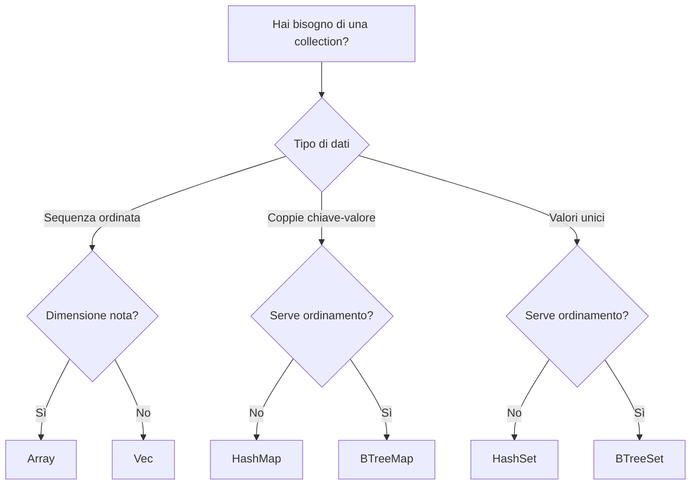

# Collections

!!! info "Riferimento originale"
    📖 [Documentazione originale](https://doc.rust-lang.org/std/collections/)
    🔄 Traduzione in corso
    📝 Versione Rust: 1.90+

Le **collections** di Rust sono strutture dati che possono contenere valori multipli. A differenza degli array, i dati delle collection sono allocati sullo heap, il che significa che la quantità di dati non deve essere nota a compile-time e può crescere o ridursi durante l'esecuzione del programma.

---

## 📚 Collections Disponibili

### ✅ Tradotte

- **[Vec\<T\>](vec.md)** - Array dinamico ridimensionabile
  - Crescita/riduzione dinamica
  - Accesso per indice O(1)
  - Push/pop O(1) ammortizzato
  - [Vai alla documentazione →](vec.md)

### 📅 Prossimamente

Le seguenti collections verranno tradotte prossimamente:

#### HashMap\<K, V\>
Mappa hash per coppie chiave-valore con accesso O(1) medio.

🔗 [Documentazione ufficiale (EN)](https://doc.rust-lang.org/std/collections/struct.HashMap.html)

#### HashSet\<T\>
Set basato su hash per valori unici con accesso O(1) medio.

🔗 [Documentazione ufficiale (EN)](https://doc.rust-lang.org/std/collections/struct.HashSet.html)

#### BTreeMap\<K, V\>
Mappa ordinata basata su B-tree con accesso O(log n).

🔗 [Documentazione ufficiale (EN)](https://doc.rust-lang.org/std/collections/struct.BTreeMap.html)

#### BTreeSet\<T\>
Set ordinato basato su B-tree con accesso O(log n).

🔗 [Documentazione ufficiale (EN)](https://doc.rust-lang.org/std/collections/struct.BTreeSet.html)

#### VecDeque\<T\>
Coda double-ended per inserimento/rimozione efficiente da entrambi i lati.

🔗 [Documentazione ufficiale (EN)](https://doc.rust-lang.org/std/collections/struct.VecDeque.html)

#### LinkedList\<T\>
Lista doppiamente concatenata (raramente usata, preferire Vec o VecDeque).

🔗 [Documentazione ufficiale (EN)](https://doc.rust-lang.org/std/collections/struct.LinkedList.html)

#### BinaryHeap\<T\>
Heap binario (coda di priorità).

🔗 [Documentazione ufficiale (EN)](https://doc.rust-lang.org/std/collections/struct.BinaryHeap.html)

---

## 🎯 Quale Collection Usare?

### Guida Rapida

### Usa Vec quando:
- ✅ Vuoi una sequenza di elementi
- ✅ Serve accesso per indice
- ✅ Aggiungi/rimuovi principalmente alla fine
- ✅ È la collection più comune (usa questa di default)

### Usa HashMap quando:
- ✅ Vuoi associare chiavi a valori
- ✅ Serve accesso veloce per chiave
- ✅ L'ordine non è importante

### Usa HashSet quando:
- ✅ Vuoi memorizzare valori unici
- ✅ Serve verificare se un elemento esiste
- ✅ L'ordine non è importante

### Usa BTreeMap/BTreeSet quando:
- ✅ Serve iterare in ordine ordinato
- ✅ Serve trovare il min/max efficiente
- ✅ Serve range query

### Usa VecDeque quando:
- ✅ Inserisci/rimuovi da entrambi i lati
- ✅ Implementi una coda o stack

---

## 🤝 Vuoi Contribuire?

Vuoi aiutarci a tradurre HashMap, HashSet o altre collections?

[**Inizia a contribuire →**](../../CONTRIBUTING.md){ .md-button .md-button--primary }

---

## 📖 Risorse Aggiuntive

### Documentazione Ufficiale (Inglese)
- [Collections Module](https://doc.rust-lang.org/std/collections/)
- [The Book - Collections](https://doc.rust-lang.org/book/ch08-00-common-collections.html)
- [Rust by Example - Vec](https://doc.rust-lang.org/rust-by-example/std/vec.html)

### Performance
- [std::collections Performance](https://doc.rust-lang.org/std/collections/#performance)
- [Big-O Cheat Sheet](https://www.bigocheatsheet.com/)

---

**Ultima revisione**: Ottobre 2025
**Versione Rust**: 1.90+

*Documentazione originale © The Rust Project Developers | Traduzione © Rust Italia Community*
