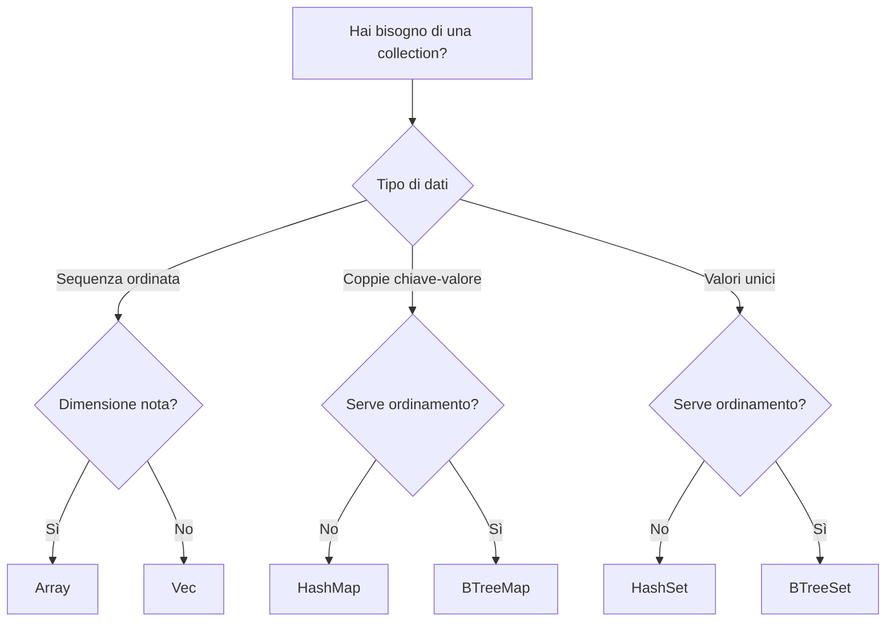

# Collections

!!! info "Riferimento originale"
    📖 [Documentazione originale](https://doc.rust-lang.org/std/collections/)
    🔄 Traduzione in corso
    📝 Versione Rust: 1.90+

Le **collections** di Rust sono strutture dati che possono contenere valori multipli. A differenza degli array, i dati delle collection sono allocati sullo heap, il che significa che la quantità di dati non deve essere nota a compile-time e può crescere o ridursi durante l'esecuzione del programma.

---

## 📚 Collections Disponibili

### ✅ Tradotte

- **[Vec\<T\>](vec.md)** - Array dinamico ridimensionabile
  - Crescita/riduzione dinamica
  - Accesso per indice O(1)
  - Push/pop O(1) ammortizzato
  - [Vai alla documentazione →](vec.md)

### 📅 Prossimamente

Le seguenti collections verranno tradotte prossimamente:

#### HashMap\<K, V\>
Mappa hash per coppie chiave-valore con accesso O(1) medio.

🔗 [Documentazione ufficiale (EN)](https://doc.rust-lang.org/std/collections/struct.HashMap.html)

#### HashSet\<T\>
Set basato su hash per valori unici con accesso O(1) medio.

🔗 [Documentazione ufficiale (EN)](https://doc.rust-lang.org/std/collections/struct.HashSet.html)

#### BTreeMap\<K, V\>
Mappa ordinata basata su B-tree con accesso O(log n).

🔗 [Documentazione ufficiale (EN)](https://doc.rust-lang.org/std/collections/struct.BTreeMap.html)

#### BTreeSet\<T\>
Set ordinato basato su B-tree con accesso O(log n).

🔗 [Documentazione ufficiale (EN)](https://doc.rust-lang.org/std/collections/struct.BTreeSet.html)

#### VecDeque\<T\>
Coda double-ended per inserimento/rimozione efficiente da entrambi i lati.

🔗 [Documentazione ufficiale (EN)](https://doc.rust-lang.org/std/collections/struct.VecDeque.html)

#### LinkedList\<T\>
Lista doppiamente concatenata (raramente usata, preferire Vec o VecDeque).

🔗 [Documentazione ufficiale (EN)](https://doc.rust-lang.org/std/collections/struct.LinkedList.html)

#### BinaryHeap\<T\>
Heap binario (coda di priorità).

🔗 [Documentazione ufficiale (EN)](https://doc.rust-lang.org/std/collections/struct.BinaryHeap.html)

---

## 🎯 Quale Collection Usare?

### Guida Rapida

### Usa Vec quando:
- ✅ Vuoi una sequenza di elementi
- ✅ Serve accesso per indice
- ✅ Aggiungi/rimuovi principalmente alla fine
- ✅ È la collection più comune (usa questa di default)

### Usa HashMap quando:
- ✅ Vuoi associare chiavi a valori
- ✅ Serve accesso veloce per chiave
- ✅ L'ordine non è importante

### Usa HashSet quando:
- ✅ Vuoi memorizzare valori unici
- ✅ Serve verificare se un elemento esiste
- ✅ L'ordine non è importante

### Usa BTreeMap/BTreeSet quando:
- ✅ Serve iterare in ordine ordinato
- ✅ Serve trovare il min/max efficiente
- ✅ Serve range query

### Usa VecDeque quando:
- ✅ Inserisci/rimuovi da entrambi i lati
- ✅ Implementi una coda o stack

---

### Performance
Per scegliere la raccolta giusta per il lavoro è necessario comprendere i punti di forza di ciascuna collection. Di seguito riassumiamo brevemente le prestazioni delle diverse collection per alcune operazioni importanti. Per ulteriori dettagli, consultare la documentazione relativa a ciascun tipo e tenere presente che i nomi dei metodi effettivi potrebbero differire da quelli riportati nelle tabelle sottostanti per alcune raccolte.

In tutta la documentazione, ci atterremo alle seguenti convenzioni per la notazione delle operazioni:
  - La dimensione della collection è indicata con n.
  - Se è coinvolta una seconda collection, la sua dimensione è indicata con m.
  - Gli indici degli elementi sono indicati con i.
  - Le operazioni che hanno un costo ammortizzato sono contrassegnate dal suffisso *.
  - Le operazioni con un costo previsto sono contrassegnate dal suffisso ~.

La chiamata di operazioni che aggiungono elementi a una collection richiederà occasionalmente il ridimensionamento di essa, un'operazione aggiuntiva che richiede un tempo O(n).

I costi ammortizzati sono calcolati per tenere conto del costo in termini di tempo di tali operazioni di ridimensionamento su una serie sufficientemente ampia di operazioni. Una singola operazione può essere più lenta o più veloce a causa della natura sporadica del ridimensionamento della collection, tuttavia il costo medio per operazione si avvicinerà al costo ammortizzato.

Le raccolte di Rust non si riducono mai automaticamente, quindi sle operazioni di rimozione non sono ammortizzate.
HashMap utilizza i costi previsti. È teoricamente possibile, anche se molto improbabile, che HashMap abbia prestazioni significativamente peggiori rispetto al costo previsto. Ciò è dovuto alla natura probabilistica dell'hashing, ovvero è possibile generare un hash duplicato dato un determinato input chiave che richiederà un calcolo aggiuntivo per essere corretto.

#### Costo delle operazioni riassunto

| Struttura     | get(i)           | insert(i)              | remove(i)              | append(Vec(m)) | split_off(i)        | range        | append     |
|----------------|------------------|-------------------------|------------------------|----------------|---------------------|--------------|-------------|
| **Vec**        | O(1)             | O(n−i)\*               | O(n−i)                 | O(m)\*         | O(n−i)              | N/A          | N/A         |
| **VecDeque**   | O(1)             | O(min(i, n−i))\*       | O(min(i, n−i))         | O(m)\*         | O(min(i, n−i))      | N/A          | N/A         |
| **LinkedList** | O(min(i, n−i))   | O(min(i, n−i))         | O(min(i, n−i))         | O(1)           | O(min(i, n−i))      | N/A          | N/A         |
| **HashMap**    | O(1)~            | O(1)~\*                | O(1)~                  | N/A            | N/A                 | N/A          | N/A         |
| **BTreeMap**   | O(log n)         | O(log n)               | O(log n)               | N/A            | N/A                 | O(log n)     | O(n+m)      |

!!! note
    Si noti che in caso di parità, Vec sarà generalmente più veloce di VecDeque, mentre VecDeque sarà generalmente più veloce di LinkedList.
    Per gli insiemi, tutte le operazioni hanno lo stesso costo delle operazioni equivalenti su Map.

### Correct and Efficient Usage of Collections
Naturalmente, sapere quale collection è quella giusta per il lavoro non ti permette immediatamente di implementarla correttamente. Ecco alcuni suggerimenti rapidi per un uso efficiente e corretto delle collection standard. Se sei interessato a come utilizzarne una specifica in particolare, consulta la relativa documentazione per una discussione dettagliata ed esempi di codice.

### Capacity Management 
Molte collection forniscono diversi costruttori e metodi che fanno riferimento alla “capacità”. Queste raccolte sono generalmente costruite su un array. Idealmente, questo array dovrebbe avere esattamente le dimensioni giuste per contenere solo gli elementi memorizzati nella collection, ma sarebbe molto inefficiente. Se l'array di supporto avesse sempre le dimensioni giuste, ogni volta che viene inserito un elemento, la collection dovrebbe aumentare le dimensioni dell'array per contenerlo. A causa del modo in cui la memoria viene allocata e gestita sulla maggior parte dei computer, ciò richiederebbe quasi certamente l'allocazione di un array completamente nuovo e la copia di ogni singolo elemento da quello vecchio a quello nuovo. È facile intuire che ciò non sarebbe molto efficiente da fare ad ogni operazione.
La maggior parte delle collection utilizza quindi una strategia di allocazione ammortizzata. In genere si lasciano una discreta quantità di spazio libero in modo da dover crescere solo occasionalmente. Quando crescono, allocano un array sostanzialmente più grande in cui spostare gli elementi, in modo che ci voglia un po' di tempo prima che sia necessaria un'altra crescita. Sebbene questa strategia sia ottima in generale, sarebbe ancora meglio se la raccolta non dovesse mai ridimensionare il proprio array di supporto. Sfortunatamente, la collection stessa non dispone di informazioni sufficienti per farlo autonomamente. Pertanto, spetta a noi programmatori fornirle dei suggerimenti.

Qualsiasi costruttore **_with_capacity_** indicherà alla collection di allocare spazio sufficiente per il numero specificato di elementi. Idealmente questo sarà esattamente per quel numero di elementi, ma alcuni dettagli di implementazione potrebbero impedirlo. Per ulteriori dettagli, consultare la documentazione specifica della collection. In generale, utilizzare **_with_capacity_** quando si conosce esattamente il numero di elementi che verranno inseriti, o almeno si dispone di un limite massimo ragionevole per quel numero.

Quando si prevede un grande afflusso di elementi, è possibile utilizzare la famiglia di metodi reserve per indicare alla collezione quanto spazio deve riservare per gli elementi in arrivo. Come per **_with_capacity_**, il comportamento preciso di questi metodi sarà specifico per la collection di interesse.
Per ottenere prestazioni ottimali, le collezioni generalmente evitano di ridursi. Se si ritiene che una collection non conterrà presto altri elementi, o semplicemente si ha davvero bisogno della memoria, il metodo **_shrink_to_fit_** richiede alla collection di ridurre l'array di supporto alla dimensione minima in grado di contenere i suoi elementi.
Infine, se si è interessati alla capacità effettiva della collection, la maggior parte delle collection fornisce un metodo capacity per richiedere queste informazioni su richiesta. Ciò può essere utile per scopi di debug o per l'uso con i metodi **_reserve_**.

---

## 🤝 Vuoi Contribuire?

Vuoi aiutarci a tradurre HashMap, HashSet o altre collections?

[**Inizia a contribuire →**](../../CONTRIBUTING.md){ .md-button .md-button--primary }

---

## 📖 Risorse Aggiuntive

### Documentazione Ufficiale (Inglese)
- [Collections Module](https://doc.rust-lang.org/std/collections/)
- [The Book - Collections](https://doc.rust-lang.org/book/ch08-00-common-collections.html)
- [Rust by Example - Vec](https://doc.rust-lang.org/rust-by-example/std/vec.html)

### Performance
- [std::collections Performance](https://doc.rust-lang.org/std/collections/#performance)
- [Big-O Cheat Sheet](https://www.bigocheatsheet.com/)

---

**Ultima revisione**: Ottobre 2025
**Versione Rust**: 1.90+

*Documentazione originale © The Rust Project Developers | Traduzione © Rust Italia Community*
